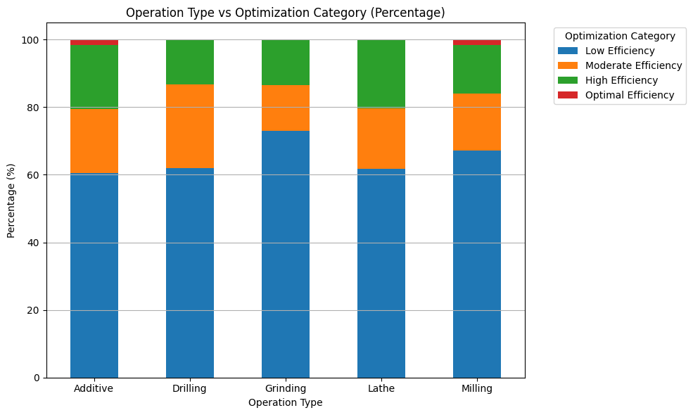

# Hybrid Manufacturing Systems (HMS) Dataset README

## 📂 Dataset Overview
본 프로젝트에서 사용된 데이터셋은 Kaggle에서 제공하는 "Manufacturing Production Data"입니다.

🔗 [https://www.kaggle.com/datasets/ziya07/manufacturing-production-data](https://www.kaggle.com/datasets/ziya07/manufacturing-production-data)

이 데이터셋은 하이브리드 제조 시스템(HMS)에서 수집된 생산 계획 및 최적화 데이터를 포함하고 있으며, 작업 스케줄링, 자원 할당, 효율성 최적화에 중점을 두고 있습니다.

본 데이터셋은 생산 공정의 효율성 향상을 위한 자원 배분 및 의사결정을 지원하기 위해 설계되었습니다.

## 📅 Features (Key Columns)
| Column Name | Description | Data Type |
|:---|:---|:---|
| Operation_Type | 작업 종류 (Grinding, Additive, Lathe 등) | object (string) |
| Processing_Time | 가공 시간 (분 단위 추정) | int64 |
| Energy_Consumption | 에너지 소비량 | float64 |
| Machine_Availability | 기계 가용성 (%) | int64 |
| Optimization_Category | 생산 효율 범주 (Low, Moderate, High, Optimal) | object (string) |

## 📑 Data Description

- **Operation_Type**: 수행된 제조 작업의 종류를 나타냅니다. 주요 값으로는 Grinding, Additive, Lathe, Milling, Drilling 이 있습니다.
- **Processing_Time**: 한 작업을 완료하는 데 걸린 시간입니다. 단위는 분(minute)이며, 대략 10~120분 범위에 분포합니다.
- **Energy_Consumption**: 작업 과정에서 소비된 에너지량입니다. 단위는 kWh로 추정되며, 에너지 효율성과 관련된 주요 지표입니다.
- **Machine_Availability**: 특정 기간 동안 기계가 사용 가능했던 비율을 나타냅니다. 0~100%로 표현되며, 높은 수치는 생산 효율이 좋음을 의미할 수 있습니다.
- **Optimization_Category**: 생산 최적화 수준을 분류한 범주형 변수입니다. Low, Moderate, High, Optimal 네 단계로 구분됩니다.

## 📊 Target Variable: Optimization_Category
Optimization_Category는 각 작업의 최적화 수준을 4개 범주로 구분합니다:
- **Low Efficiency (0-40점)**: 높은 지연, 실패율
- **Moderate Efficiency (41-70점)**: 수용 가능하지만 최적은 아님
- **High Efficiency (71-90점)**: 약간의 비효율성은 있으나 잘 최적화됨
- **Optimal Efficiency (91-100점)**: 거의 이상적인 상태, 최소한의 지연

※ 내부적으로 점수(0~100)가 존재하지만, 공개된 데이터에는 점수가 아닌 "범주(label)"만 제공됩니다.

## 💡 Hypothesis Testing Summary
본 프로젝트는 HMS 데이터를 활용하여 기초적인 데이터 분석 연습을 위한 가설 설정과 시각화를 수행하였습니다.

### ① 기계 가용성과 최적화 수준

- **가설**: 기계 가용성이 높을수록 최적화 수준준도 높을 것이다.
- **결과**: 박스플롯 해석 결과, 범주 간 중앙값 차이가 작고 IQR 겹침이 커서 **경향이 뚜렷하지 않음**

### ② 에너지 소비량과 최적화 수준

- **가설**: 에너지 소비량이 많을수록 최적화 수준이 낮을 것이다.
- **결과**: 박스플롯 상에서 Low Efficiency는 소비량이 많고 Optimal은 적은 경향이 뚜렷하여 **지지됨**

### ③ 가공 시간과 최적화 수준

- **가설**: 가공 시간이 길수록 최적화 수준이 낮을 것이다.
- **결과**: Optimal Efficiency가 오히려 더 긴 경우도 있어 **가설은 반박됨**

### ④ 작업 종류와 최적화 수준

- **가설**: 작업 종류에 따라 최적화 수준에 차이가 있을 것이다.
- **결과**: 건수 기준 카운트플롯에서는 차이가 있어 보였지만, 비율 기준으로 보면 큰 차이가 없어 **가설은 약하게 지지됨**

## 🔍 Insights
- 단일 수치나 시각화만으로 결론을 내리기보다는, **여러 시각적 요소와 분포 특성들을 함께 종합적으로 고려해야** 신뢰도 높은 분석 결과를 도출할 수 있습니다.
- 데이터 분석에서는 가설이 맞지 않더라도 **그 과정 자체가 의미 있는 통찰을 제공합니다.**
- 본 프로젝트는 시각화 해석 능력, 데이터 기반 사고력 향상에 중점을 둔 연습이었습니다.
